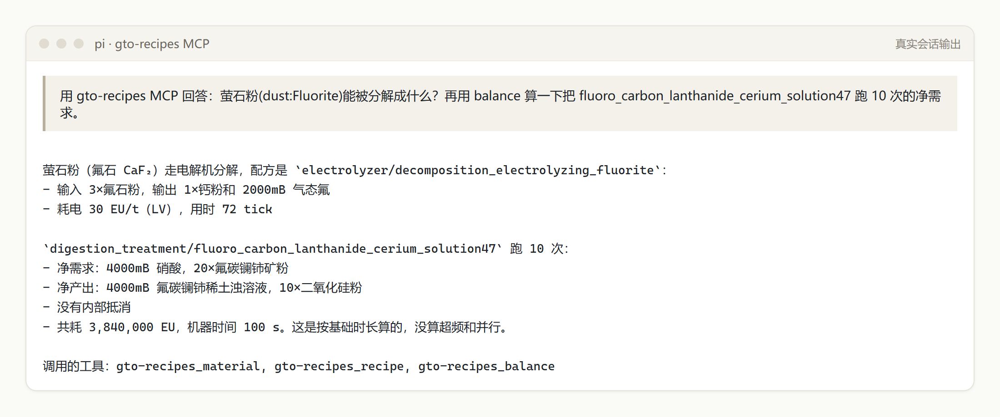
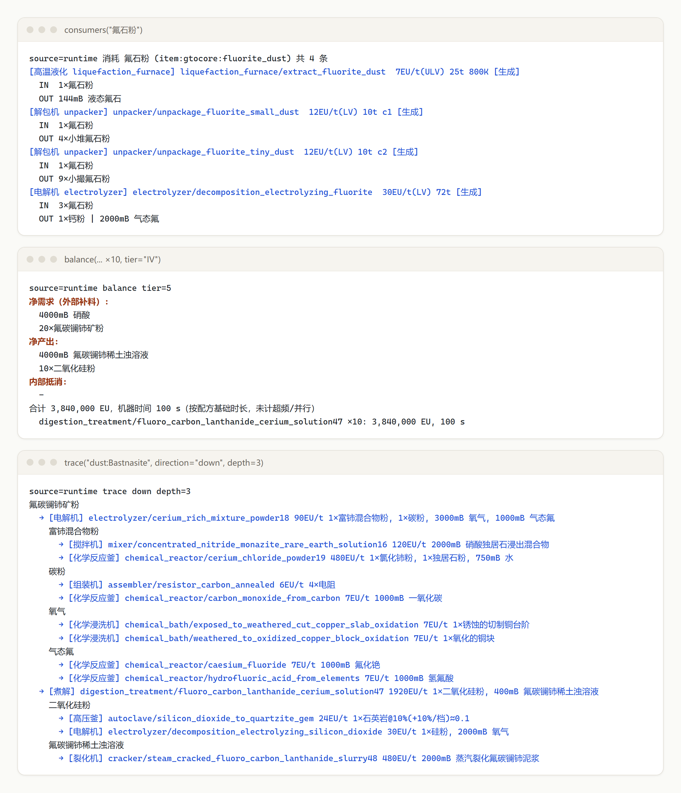

# gto-recipe-mcp

GregTech Odyssey 的只读配方查询 MCP，可以查谁产 X、谁吃 X、这条配方在哪台机器上跑、跑 N 次的净进出是多少。数据来自游戏运行时导出，包含材料分解、矿石处理这类自动生成的配方。

> **内置数据为普通难度（Normal）。** 难度会改写配方和数值。简单或专家难度的玩家，需要在自己的实例里运行一次 `exporter/run_export.py`（见「更新数据」）。导出器会按该实例 `config/gtocore.yaml` 中的难度重新导出，并记录到 `data/runtime/meta.json`。




## 数据版本

| 项 | 值 |
|---|---|
| 整合包 | GregTech Odyssey 0.5.6-beta · **普通难度（Normal）** |
| 模组 | gtocore 0.5.6-beta · GTCEu 26.7.3 (GTO fork) · GTOLib 26.7.4 |
| 游戏 | Minecraft 1.20.1 · Forge 47.4.20 |
| 内容 | 51714 条配方 / 183 类 · 1055 台机器 · 1900 种材料 |

## 快速开始

```bash
git clone https://github.com/Huoyuuu/gto-recipe-mcp && cd gto-recipe-mcp
uv sync && uv run pytest -q
```

在 MCP 客户端的配置里加入下面这段。pi 的配置文件是 `~/.pi/agent/mcp-adapter.json`，Claude Desktop 等客户端格式相同：

```json
"gto-recipes": { "command": "uv", "args": ["--directory", "<仓库路径>", "run", "gto-mcp"] }
```

重开会话后，直接用中文提问即可，例如：

- 「谁消耗萤石粉？」
- 「溶解罐和溶解核心能跑哪些配方？」
- 「煮解氟碳铈矿跑 10 次要补多少硝酸？」

## 工具

`search` `recipe` `producers` `consumers` `machines_for` `machine` `material` `trace` `balance` `me_parts`

物品可以用 registry id、`dust:Bastnasite`、中文名或模糊词来指定。每次返回约 4 KB，超出部分用 `offset` 翻页。

## 更新数据

```bash
powershell -File exporter/build.ps1
uv run python exporter/run_export.py --instance "<实例目录>"
```

运行时会用离线账号启动实例，约 70 秒，导出后自动退出并移除导出模组。

## 已知限制

- 概率 boost 按 GTCEu 默认公式计算，未核实 GTO 是否改写。
- 并行和超频由 GTOLib native 代码处理，这里没有计入。
- 210 台 GTO 多方块的仓室信息来自静态源码。

MIT License
